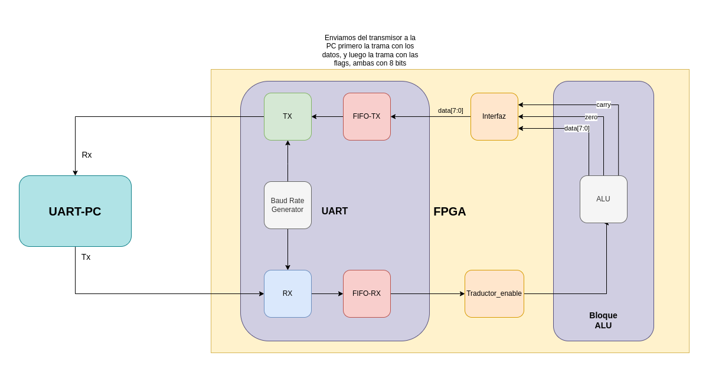
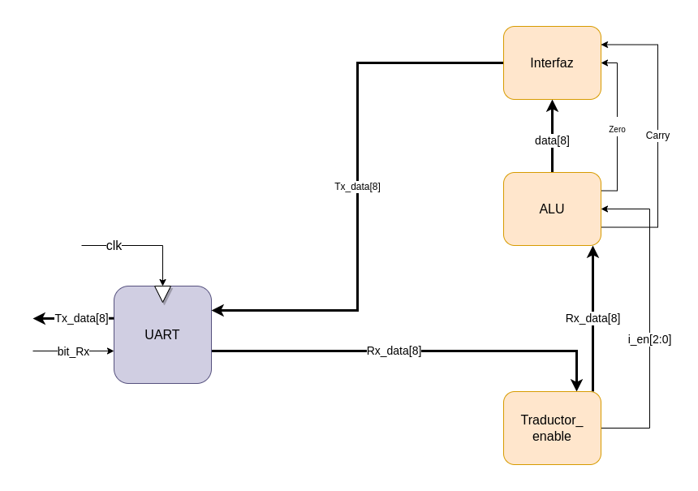
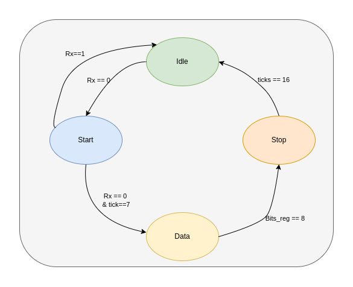
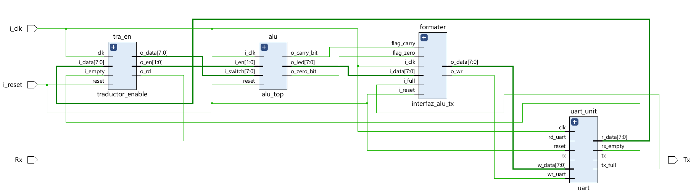
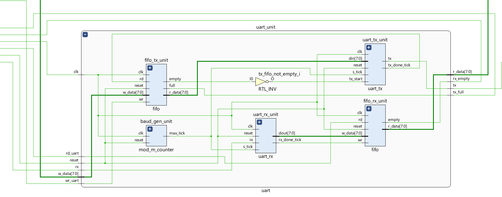
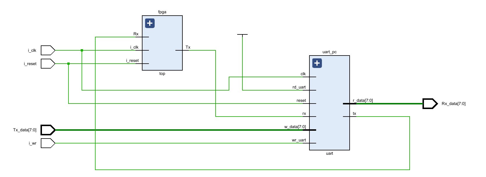
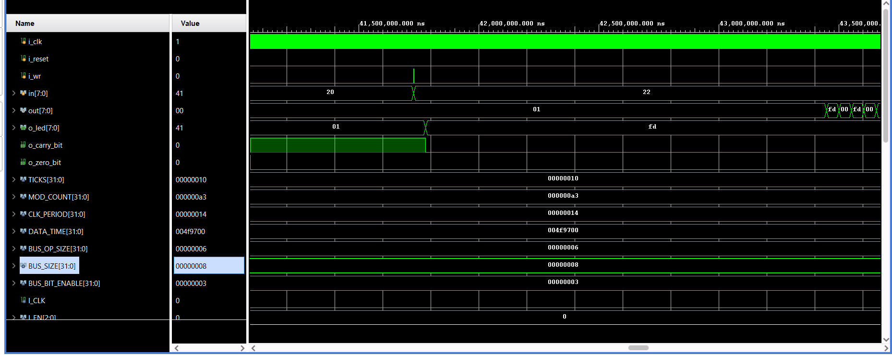

# Init
# FPGA-UART PROJECT
En este repositorio usted encontrará los source para poder crear un módulo de transmisión y recepción UART con todos los módulos necesarios para su funcionamiento como podría ser el baud rate generator. A su vez se encuentra el projecto anterior [FPGA-ALU](https://github.com/JuanManuel-Cloud/FPGA-ALU) donde está el módulo ALU. La idea del proyecto es la comunicación UART entre un usuario vía PC, se le envían datos a la ALU está realiza la operación y devuelve el resultado hacia la computadora.
Para clonar el repo siga los siguientes pasos

1. ```git clone git@github.com:JuanManuel-Cloud/FPGA-UART.git```
   ```cd fpga-uart.srcs/sources_1/alu```
2. ```git submodule init```
3. ```git submodule update```

Otra alternativa es utilizar directamente el comando

```git clone --recurse-submodules git@github.com:JuanManuel-Cloud/FPGA-UART.git```

# Informe
# TP-N°2_ FPGA-UART

Profesor: Pereyra, Martín

Alumnos:

- Ciordia Cantarella, Francisco | [francisco.ciordia@mi.unc.edu.ar](mailto:francisco.ciordia@mi.unc.edu.ar) | 41.642.397
- Gil, Juan Manuel | [juan.manuel.gil@mi.unc.edu.ar](mailto:juan.manuel.gil@mi.unc.edu.ar) | 41.592.940

TP-N° 2: FPGA-UART

10 Octubre 2022

# Índice

[Índice](about:blank#%C3%ADndice)

[Introducción](about:blank#introducci%C3%B3n)

[Objetivo](about:blank#objetivo)

[Módulo UART](about:blank#m%C3%B3dulo-uart)

[Implementación](about:blank#implementaci%C3%B3n)

> Diagrama de bloques
>
>
> [Máquina de estados](about:blank#m%C3%A1quina-de-estados)
>

[FPGA Síntesis](about:blank#fpga-s%C3%ADntesis)

> UART
>

[Simulación](about:blank#simulaci%C3%B3n)

[Anexo](about:blank#anexo)

# Introducción

En este trabajo se implementa un módulo transmisor-receptor del tipo UART. Para el mismo se crean módulos auxiliares como un BaudRate-Generator, FIFOs, e interfaces para poder comunicarnos con el módulo del trabajo pasado (FPGA-ALU).

# Objetivo

El objetivo del siguiente documento es realizar una breve descripción acerca del módulo UART implementado sobre una FPGA, explicar su funcionamiento y demostrar su correcto comportamiento.

# Módulo UART

El controlador del UART es el componente clave del subsistema de comunicaciones series de una computadora. El UART toma bytes de datos y transmite los bits individuales de forma secuencial. En el destino, un segundo UART reensambla los bits en bytes completos. La transmisión serie de la información digital (bits) a través de un cable único u otros medios es mucho más efectiva en cuanto a costo que la transmisión en paralelo a través de múltiples cables. Se utiliza un UART para convertir la información transmitida entre su forma secuencial y paralela en cada terminal de enlace. Cada UART contiene un registro de desplazamiento que es el método fundamental de conversión entre las formas secuencial y paralela.

# Implementación

## Diagrama de bloques



En este primer diagrama se pueden apreciar los distintos módulos que se implementaron sobre la FPGA y su comunicación.

De izquierda a derecha, el primer módulo es externo a la FPGA, es nuestra PC, la cual utilizamos para enviar y recibir datos del UART que se implementó sobre la placa. Luego tenemos la implementación del módulo UART de la FPGA, el mismo se compone por 5 sub módulos más pequeños, el **Baud Rate Generator** el mismo se encarga de la generación de ticks para la transmisión serial. El Receptor **Rx**, este módulo va a recibir los datos provenientes de la computadora de uno en uno, una vez recibido todos los datos acordes al protocolo de comunicación los irá metiendo en el proximo modulo la **FIFO-Rx** la función de esta cola es ir recibiendo los datos de la entrada y avisar si la cola está llena, para que no se sigan ingresando datos, o si está vacía para que no se intenten retirar. El intermediario entre la cola y la ALU, que es a quien le queremos mandar los datos en este TP, se encarga de recibir un dato que nos dice el tipo, es decir, si el dato es

- ‘A’ -> el próximo dato será el operando 1.
- ‘B’ -> el próximo dato será el operando 2.
- ‘O’ -> el próximo dato será el código de operación.

De esta manera el bloque ALU tendrá los datos para realizar la operación correspondiente. Una vez que se finaliza la misma, los dato son transferidos a una **interfaz**, a la cual también llamamos formater, dicho módulo recibe tanto los datos (el resultado de la operación) como las flags resultantes, entonces va a cargar primero los el cálculo de la alu en la **FIFO-Tx**, y va a armar un buffer con las flags, y las va a cargar a continuación. De esta manera el transmisor **Tx** consumirá los buffers desde la cola, y los enviará, en este caso a nuestra PC donde podremos mostrar los resultados en distintos formatos.



Acá tenemos una simplificación de la comunicación del UART con las interfaces y la ALU.

## Máquina de estados



Acá tenemos la máquina de estados que representa el comportamiento de nuestro UART. La misma consiste de 4 estados, el inicial es **Idle** para poder pasar al estado de **Start** debemos recibir el bit de Rx (el de Tx se omite ya que su comportamiento es idéntico), notar que esperamos un cero, ya que funciona por lógica negativa, una vez en el estado de start, debemos esperar 7 ticks para poder pasar al estado de **Data** esto es porque nos centramos sobre el bit recibido y evaluamos que aun sea cero el bit de Rx y no se haya debido a alguna interferencia. Una vez en data vamos a ir recibiendo bit a bit de datos, cada bit tomara 16 ticks e irá incrementando un contador de bits, cuando bits_reg (en este caso se ejemplifica un buffer de datos de 8 bits) cuenta 8, pasamos al estado de **Stop** donde esperamos por un bit de detención, una vez que se recibe el mismo el UART vuelve a estar en el estado Idle esperando por un nuevo dato.

# FPGA Síntesis

A continuación se muestra el resultado de la síntesis realizada por Xilinx



## UART

Hacemos un poco de zoom al módulo UART que es el de nuestro interés



# Simulación



Para la simulación utilizamos 22 UARTs, dos para simular un transmisor/receptor, otra la de la FPGA, que es la que deseamos testear, el objetivo del transmisor/receptor es tener una emulación de la entrada de datos a nuestra FPGA y poder apreciar la salida de la misma.



Podemos observar la salida de la ALU (o_led) cambiando de valor 0x01 (suma) a 0xfd (resta), notar que durante la suma también teníamos el bit de carry en 1. En out, tenemos la salida del UART, en principio es solo 0x01 ya que el buffer de datos es idéntico al buffer de flags, pero luego, en la resta ya vemos como switchea entre 0xfd que es el buffer de datos con 0x00 que es el buffer de flags.

# Anexo

- [GitHub Repository](https://github.com/JuanManuel-Cloud/FPGA-UART)

**References**

UART. (2008). In *FPGA Prototyping by Verilog Examples: Xilinx Spartan-3 Version*. Wiley.
